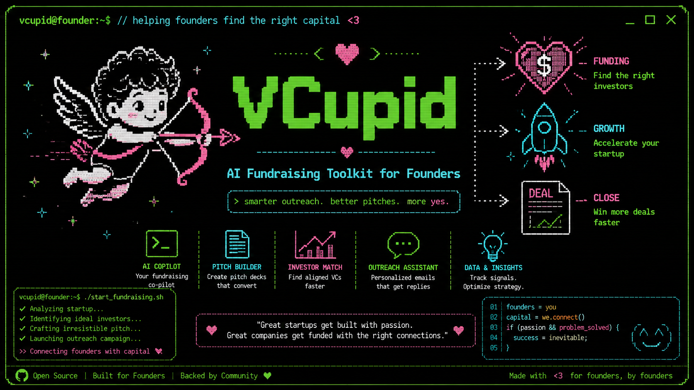

# VCupid Skills — AI Fundraising Toolkit for Founders

A set of Skills that turn your startup profile into a full VC fundraising workflow: pipeline research, fund matching, partner profiling, outreach drafting, meeting prep, and strategy.

---

## Full Fundraising Workflow

Run commands in this order for a complete fundraising campaign:

```bash

# 0. Create your STARTUP_PROFILE.md
# Use the example file with your information. 

# 1. Build the strategy
/vcraise

# 2. Research the landscape
/vclist

# 3. For each Tier 1 fund — legitimacy check first:
/vcposer <fund name>              # Is this fund real and active? Drop if score < 40.

# 4. For each fund that passes vcposer (score 60+):
/vcmatch <fund name>              # Does their mandate fit your startup?
/vcperks <fund name>              # What do they offer beyond the check?

# 5. Stress-test your pitch against the funds you're pursuing:
/vcdevil

# 6. For each fund with a vcmatch Pursue or Warm Up verdict:
/vcpartner <fund> <partner name>
/vcintro vcmatch-<fund>.md        # send outreach
/vclp vcmatch-<fund>.md           # attach the one-pager

# 7. When a meeting is booked:
/vcprep vcmatch-<fund>.md
```

**File naming convention:**

| File | Purpose |
|------|---------|
| `STARTUP_PROFILE.md` | Your startup data — update as traction grows |
| `vclist.md` | Master fund pipeline |
| `vcposer-<fund>.md` | Poser check — fund vitality, thesis authenticity, lead capacity |
| `vcmatch-<fund>.md` | Deep analysis per fund |
| `vcperks-<fund>.md` | Perks breakdown — value beyond capital, scored by relevance |
| `vcpartner-<fund>-<name>.md` | Partner brief |
| `vcintro-<fund>.md` | Outreach drafts |
| `vclp-<fund>.md` | Fund-specific one-pager |
| `vcprep-<fund>.md` | Meeting prep |
| `vcraise.md` | Fundraising strategy |
| `vcdevil.md` | Adversarial stress-test — 10 lethal questions |

---

## Installation

These commands are available as the `vcupid` Claude Code plugin. Install with a single command — works in Claude Code web or CLI:

```bash
curl -fsSL https://raw.githubusercontent.com/maxoliverbr/vcupid-plugin/main/install.sh | bash
```

The script clones the plugin to `~/.claude/plugins/vcupid/`, registers it in `~/.claude/plugins/installed_plugins.json`, and enables it in `~/.claude/settings.json`. It is idempotent — safe to re-run to update.

**Restart Claude Code.** All `/vc*` commands will be available in any directory that contains a `STARTUP_PROFILE.md`.

<details>
<summary>Local development install</summary>

If you've cloned the repo locally, you can install from the clone directly:

```bash
cd ~/dev/vcupid-plugin && bash install.sh
```

This registers the local clone path so edits to skill files take effect immediately without re-running the installer.
</details>

<details>
<summary>Manual installation</summary>

**Register in `~/.claude/plugins/installed_plugins.json`:**
```json
"vcupid@local": [{
  "scope": "user",
  "installPath": "/home/<you>/dev/vcupid",
  "version": "1.0.0",
  "installedAt": "<ISO timestamp>",
  "lastUpdated": "<ISO timestamp>"
}]
```

**Enable in `~/.claude/settings.json`:**
```json
"enabledPlugins": {
  "vcupid@local": true
}
```

</details>

---

## Tips

- **Keep `STARTUP_PROFILE.md` current.** Every new traction milestone (signed LOI, new partnership, first revenue) changes what funds you can approach and what you can say. Update it and re-run `/vcraise` monthly.
- **Run `/vcmatch` before spending time on outreach.** A 40/100 fit score is a no-go — don't write the email.
- **Use Variant B (`/vcintro`) over cold email whenever a warm path exists.** A forwarded intro converts at 5–10x the rate of cold outreach.
- **The vcprep is for rehearsal, not for the room.** Print it, rehearse it, then leave it behind — the meeting is a conversation, not a recital.
- **Update the plugin with new skills** by adding `SKILL.md` files to `skills/<name>/` and bumping `version` in `.claude-plugin/plugin.json`.

---


## Prerequisites

All commands read `STARTUP_PROFILE.md` from your current working directory. **Create this file before running any command.**

### Setting Up `STARTUP_PROFILE.md`

Create a markdown file in your project root with the following structure. The more detail you provide, the more specific and accurate every command output will be. Vague inputs produce generic outputs.

```markdown
# Startup Profile: [Company Name]

## I. Company Overview
| Field | Detail |
|-------|--------|
| **Startup Name** | [Legal company name] |
| **One-Liner** | [One sentence: what you do and for whom] |
| **Core Problem** | [The specific problem you solve — include scale/urgency] |
| **Solution** | [What you built and how it works — be technical if relevant] |
| **Key Value Prop** | [The headline outcome you deliver: time saved, cost reduced, etc.] |
| **Category** | [e.g., Deep Tech / Infrastructure / Climate / SaaS] |
| **Location & Founded** | [City, State, Country. Month Year.] |
| **Website** | [URL] |

## II. Market & Business Model
| Field | Detail |
|-------|--------|
| **Target Customer** | [Specific buyer — not "enterprises", but "grid operators at electric cooperatives"] |
| **Market Opportunity** | [Beachhead TAM with source. Expansion path.] |
| **Business Model** | [How you charge: SaaS, value-based, usage, marketplace, etc.] |

## III. Traction & Milestones
| Field | Detail |
|-------|--------|
| **Product Stage** | [Idea / MVP / MVBP / Revenue / Growth] |
| **Product Launch** | [Target date or "Live as of [date]"] |
| **Traction** | [Be specific: design partners, LOIs, revenue, pilots, grants, gov partnerships] |
| **Referral** | [Any warm contacts who can open VC doors — Name, email, relationship] |

## IV. Team
| Role | Name | Key Highlights |
|------|------|---------------|
| **CEO** | [Name] | [3–5 most relevant credentials for investors] |
| **CTO** | [Name] | [3–5 most relevant credentials for investors] |
| [Other] | [Name] | [Credentials] |

## V. Fundraise
| Field | Detail |
|-------|--------|
| **Raise Amount** | [$XM] |
| **Instrument** | [SAFE / Priced Seed / TBD] |
| **Use of Funds** | [Top 3 line items] |
| **Milestone this raise funds** | [What you'll have accomplished when the money runs out] |
```

**Tips for a strong profile:**
- Use specific numbers everywhere: "$5M DOE proposal", "38,000-member LinkedIn group", "$30.2M transmission project" — not "large DOE proposal"
- Name your referrals with contact info — the outreach commands use them
- Describe the problem with the urgency a VC would feel, not just the solution you built
- List credentials that matter to investors, not your full resume

---

## Commands

### `/vcraise` — Fundraising Strategy Memo

Start here. Synthesizes your profile and any existing vcmatch/vclist files into a full strategy.

```
/vcraise
```

**Reads:** `STARTUP_PROFILE.md` + any `vclist.md` and `vcmatch-*.md` in the current directory  
**Saves:** `vcraise.md`

**Output sections:**
1. Current State — honest assessment of what you have and what's missing
2. Raise Parameters — recommended amount, instrument, valuation cap, timeline
3. Sequencing Strategy — who first, parallel vs. sequential, how to create urgency
4. Milestone Map — which proof points unlock which tier of investors
5. Month-by-Month Timeline — from today through close
6. Risk Factors & Contingencies — what derails the raise and the fallback for each
7. This Week — Next 3 Actions — concrete, specific, doable in 7 days

---

### `/vclist` — VC Target Pipeline

Research the VC landscape and produce a ranked list of 15–20 funds to target.

```
/vclist
```

**Reads:** `STARTUP_PROFILE.md`  
**Saves:** `vclist.md`

**Output:** Three tiers of funds with rationale and suggested contact angle per fund:
- **Tier 1 — Pursue Now:** Strong fit, correct stage, warm path exists
- **Tier 2 — Warm Up First:** Good thesis fit, missing proof point or intro
- **Tier 3 — Monitor:** Stage mismatch or unclear path — revisit later

Run this before `/vcmatch` to know which funds are worth the deep analysis.

---

### `/vcposer` — VC Poser Detector

Pre-filter funds from your pipeline before committing to a full match analysis. Runs 8 evidence-based checks on whether a fund is actually active and writing checks — independent of whether their thesis fits your startup.

```
/vcposer <VC Fund Name>
```

**Example:** `/vcposer "Slow Ventures"` or `/vcposer a16z`  
**Reads:** `STARTUP_PROFILE.md` (for stage/sector calibration)  
**Saves:** `vcposer-<fund>.md`

**Output — Poser Score (0–100) across 8 checks:**
- **Fund Vitality** — Last investment date. >18 months silent = zombie risk.
- **Fund Health** — Active fund with dry powder? Key partner departures?
- **Thesis Authenticity** — Does their portfolio actually match their stated sector thesis?
- **Lead vs. Follow** — Evidence of leading rounds, not just co-investing.
- **Stage Honesty** — Stated stage vs. actual entry stage of recent investments.
- **Check Size Reality** — Stated range vs. observable deal sizes.
- **Signal-to-Check Ratio** — Conference/content volume vs. actual new deals.
- **Founder Sentiment** — Public feedback patterns — ghosting, slow decisions, reneging.

**Verdict tiers:**
- **Legit (80–100):** Active fund, real checks. Proceed to `/vcmatch`.
- **Probable (60–79):** Yellow flags — prioritize if fit is strong, clarify open questions.
- **Watch List (40–59):** Material poser signals. De-prioritize unless a warm intro exists.
- **Likely Poser (0–39):** Don't waste cycles. Move to the next fund.

> **vcposer ≠ vcmatch.** Poser Score answers "is this fund real and active?" Vcmatch answers "does their mandate fit our startup?" You need both. A fund can be fully legit but wrong for your stage — and a fund can claim a perfect thesis but be a zombie. Run `/vcposer` first, then `/vcmatch` only for funds that score 60+.

---

### `/vcmatch` — Fund Fit Analysis

Deep research on a single fund against your startup profile. Scores the match and identifies exactly how to approach them.

```
/vcmatch <VC Fund Name>
```

**Example:** `/vcmatch a16z` or `/vcmatch "Lowercarbon Capital"`  
**Reads:** `STARTUP_PROFILE.md`  
**Saves:** `vcmatch-<fund>.md`

**Output sections:**
1. Fund Overview — thesis, stage, sector, check size, key partners
2. Mandate Alignment — line-by-line comparison table
3. Fit Score — /100 with breakdown by sector, stage, team, traction, thesis
4. Optimal Pitch Angle — which partner to target, verbatim opening hook, what to lead/avoid
5. Red Flags — mandate mismatches, portfolio conflicts, thesis gaps
6. Diligence Questions to Prepare — 5–8 fund-specific questions
7. Recommended Action — Pursue / Warm Up First / No-Go with rationale

Run `/vcmatch` before `/vcpartner`, `/vcintro`, `/vclp`, or `/vcprep`.

---

### `/vcperks` — Fund Perks Researcher

Understand what a fund delivers beyond the check before you sign. Researches the full value a fund delivers beyond the check — credits and services, but also brand signal, strategic expertise, media reach, policy access, and follow-on capital pathway — scored by relevance to your startup.

```
/vcperks <VC Fund Name>
```

**Example:** `/vcperks a16z` or `/vcperks "First Round Capital"`  
**Reads:** `STARTUP_PROFILE.md` (for stage/sector calibration)  
**Saves:** `vcperks-<fund>.md`

**Part A — Financial Value** (dollar estimates, [Confirmed]/[Reported] labels):
- **Cloud & Infrastructure** — AWS/GCP/Azure credits, API platform discounts
- **Legal & Finance** — discounted counsel, accounting, cap table tools (Carta, Pulley)
- **Talent & Recruiting** — job boards, ATS discounts, executive recruiting relationships
- **Go-to-Market** — PR/comms support, CRM and sales tool discounts
- **Network & Introductions** — portfolio co. intros, LP relationships, co-investor paths
- **Operational Support** — office space, co-working, founder summits
- **Formal Programs** — structured accelerator tracks, office hours, mentorship

**Part B — Non-Financial Value** (impact ratings, qualitative assessment):
- **Brand & Signal Value** — what the fund's name does for customer credibility, talent attraction, and future round momentum
- **Strategic Guidance & Pattern Recognition** — named GP expertise, comparable investments they've led, operating partners
- **Content & Media Amplification** — publishing access, newsletter reach, event speaking, social amplification
- **Policy & Regulatory Access** — government relations team, compliance guidance, agency relationships
- **Follow-on Capital Pathway** — pro rata appetite, reserve pool, bridge capacity, Series A syndication partners, fund lifecycle

Closes with a **Gaps** section (benchmarked against named peer funds) and a **Questions to Ask the Fund Directly** section from unresolved research.

> For most seed-stage companies, the non-financial value — brand signal, strategic depth, follow-on pathway — is worth more over a 5-year relationship than the credits. `/vcperks` covers both.

---

### `/vcpartner` — Partner Deep Profile

Know who's in the room before you walk in. Research a specific GP's personal thesis, deals they've led, public writing, and how they map to your startup.

```
/vcpartner <fund> <partner name>
```

**Example:** `/vcpartner a16z "Erin Price-Wright"`  
**Reads:** `STARTUP_PROFILE.md`  
**Saves:** `vcpartner-<fund>-<lastname>.md`

**Output sections:**
1. Background — career path and pre-VC experience
2. Personal Thesis — what they personally care about, with direct quotes
3. Deals They've Led — companies, stage, sector, why they backed them
4. Public Writing & Key Quotes — specific essays and clips relevant to your startup
5. Personal Touchpoints — conferences, topics they post about, shared background
6. Fit Assessment — how this partner specifically maps to your team and problem
7. Conversation Starters — 3 specific, sourced things to bring up in the meeting

---

### `/vcintro` — Outreach Drafter

Turn a vcmatch report into ready-to-send outreach. Three variants for every situation.

```
/vcintro <vcmatch-report.md>
```

**Example:** `/vcintro vcmatch-a16z.md`  
**Reads:** `STARTUP_PROFILE.md` + vcmatch report  
**Saves:** `vcintro-<fund>.md`

**Output — three variants:**
- **Variant A — Cold Email:** 4-sentence direct email to the target partner. Subject line references their thesis.
- **Variant B — Warm Intro Request:** A note to your referral contact (from your profile), ready to forward to the partner.
- **Variant C — LinkedIn DM:** 3 sentences. No deck link. Opens with the fund-specific hook.

Each variant uses the verbatim opening hook from the vcmatch report — never generic. The skill recommends which variant to use based on your available warm paths.

> ⚠️ If the vcmatch Recommended Action is **No-Go**, this command will stop and tell you — don't send outreach to a no-go fund.

---

### `/vclp` — Fund-Specific One-Pager

A one-page executive summary written entirely in the fund's language and framed around their thesis. Not a generic company description.

```
/vclp <vcmatch-report.md>
```

**Example:** `/vclp vcmatch-a16z.md`  
**Reads:** `STARTUP_PROFILE.md` + vcmatch report  
**Saves:** `vclp-<fund>.md`

**Output sections (≤500 words total):**
- Headline — one-liner reframed in the fund's thesis language
- The Problem — uses the fund's own published framing
- The Solution — mapped to their portfolio language
- Traction — only the proof points that scored highest for this fund
- Market — sized in terms this fund cares about
- Team — only the credentials that matter to this fund
- The Ask — amount + milestone unlocked + timeline
- Why Now — fund-specific urgency tied to their thesis

> ⚠️ Each one-pager is fund-specific. Do not send to other funds without running `/vcmatch <fund>` first.

Attach this to Variant A or B of `/vcintro`.

---

### `/vcprep` — 15-Minute Pitch Meeting Prep

Full prep for a pitch meeting: timed agenda, verbatim talking points per segment, preemptive answers to every diligence question from the vcmatch report, red flag rebuttals, and the exact ask.

```
/vcprep <vcmatch-report.md>
```

**Example:** `/vcprep vcmatch-a16z.md`  
**Reads:** `STARTUP_PROFILE.md` + vcmatch report  
**Saves:** `vcprep-<fund>.md`

**Output:**
- 15-minute timed agenda (8 segments)
- Segment scripts: what to say, what to show, what NOT to say — for each segment
- Preemptive answers to every diligence question from the vcmatch report (with "if they push" follow-ups)
- Red flag rebuttals — one-liner responses for each vcmatch red flag
- The Ask — exact amount, 90-day plan, leave-behind action
- Meeting discipline — 3 rules for controlling the room

---

### `/vcdevil` — The Startup Destroyer

Before you pitch anyone, get destroyed first. A cocky, arrogant VC partner who's seen a thousand pitches like yours tears your startup apart with the 10 hardest questions he can find in your profile.

```
/vcdevil
```

**Reads:** `STARTUP_PROFILE.md`  
**Saves:** `vcdevil.md`

**Output:** 10 lethal questions derived from your actual profile — not generic diligence, but the specific traps your startup walks into. Each question includes:
- A setup line in character (bored, contemptuous, or mocking)
- The question itself, phrased to sting
- **Why this kills you** — the exact vulnerability it exposes
- **What a real answer looks like** — the framework for a rebuttal that shuts him up

Run this before any outreach. The questions you can't answer in 30 seconds are the gaps to close first.

---

